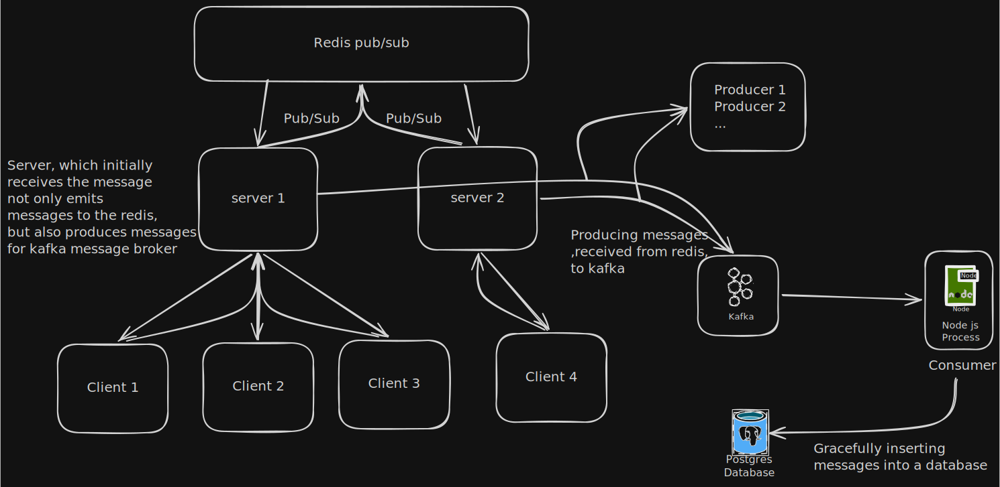

# Project's Backend Architecture for scalability

# Installation using Docker

# Enable BuildKit

export DOCKER_BUILDKIT=1
export TURBO_TOKEN=your_vercel_token

# -------------------------

# Frontend

# -------------------------

docker build \
 --secret id=turbo_token,env=TURBO_TOKEN \
 --build-arg TURBO_TEAM=my-team \
 --build-arg NEXT_PUBLIC_BACKEND_URL=http://localhost:8000 \
 --build-arg NEXT_PUBLIC_APP_URL=http://localhost:3000 \
 --build-arg NEXT_PUBLIC_WS_URL=ws://localhost:8080 \
 -f ./docker/Dockerfile.frontend \
 -t excalidraw-frontend .

# -------------------------

# HTTP Backend

# -------------------------

export DOCKER_BUILDKIT=1
export TURBO_TOKEN=your_vercel_token

docker build \
 --secret id=turbo_token,env=TURBO_TOKEN \
 --build-arg TURBO_TEAM=my-team \
 -f ./docker/Dockerfile.http-be \
 -t http-backend .

docker run --env-file /path/to/env/file -p 8000:8000 http-backend

# -------------------------

# WS Backend

# -------------------------

export DOCKER_BUILDKIT=1
export TURBO_TOKEN=your_vercel_token

docker build \
 --secret id=turbo_token,env=TURBO_TOKEN \
 --build-arg TURBO_TEAM=my-team \
 -f ./docker/Dockerfile.ws-be \
 -t ws-backend .

docker run --env-file /path/to/env/file -p 8080:8080 ws-backend
